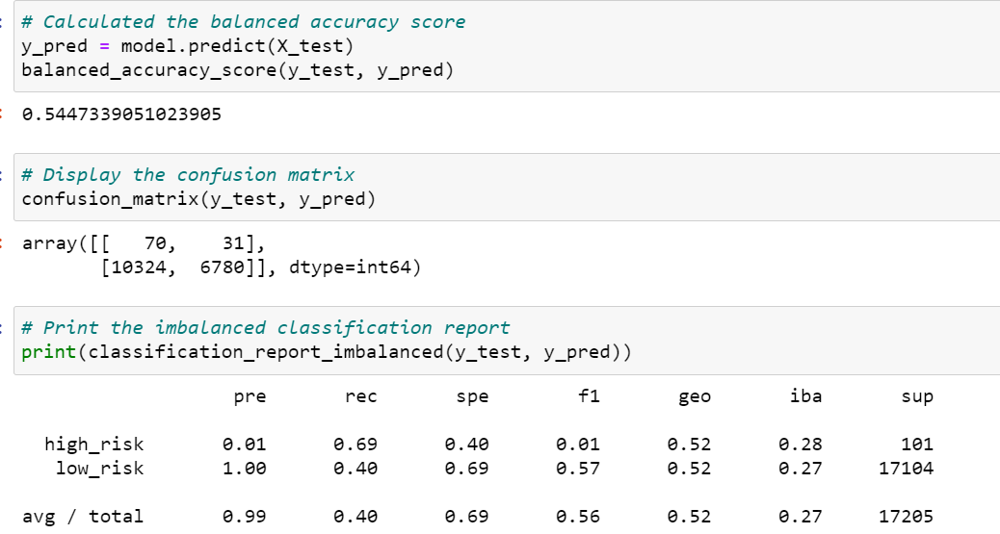
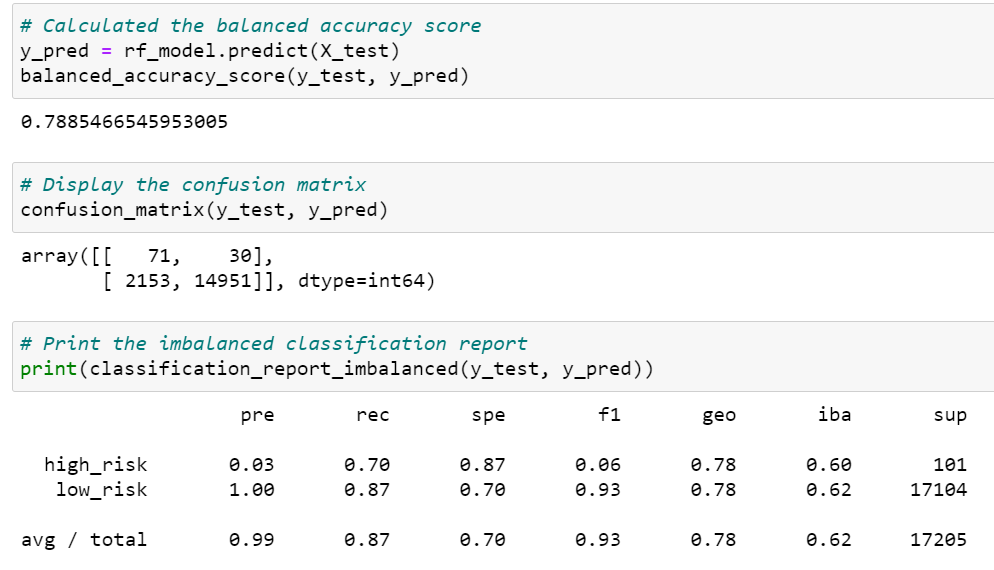

# Credit Risk Analysis

## **Overview of the analysis**: 

### Credit risk is an inherently unbalanced classification problem, as good loans easily outnumber risky loans. In this analysis, we were asked to employ different techniques to train and evaluate models with unbalanced classes. We used imbalanced-learn and scikit-learn libraries to build and evaluate models using resampling.

#### Using the credit card credit dataset from LendingClub, a peer-to-peer lending services company, we oversampled the data using the RandomOverSampler and SMOTE algorithms, and undersampled the data using the ClusterCentroids algorithm, using a combinatorial approach of over- and undersampling using the SMOTEENN algorithm. 

#### Next, we compared two new machine learning models that reduce bias, BalancedRandomForestClassifier and EasyEnsembleClassifier, to predict credit risk. In the analysis below, we evaluated the performance of these models and are making a recommendation on which model to use in order to better predict credit risk.

## **Results of the Analysis**:

### Below is a summary of each of the six machine learning models' balanced accuracy scores and precision and recall scores:

1. **Naive Random Oversampling**: the balanced accuracy score is **67%**, while the overall precision score is **99%** and the overall recall score is **63%**. The precision score for predicting high risk accounts was very low at 1% and very high for predicting low risk at 100%.

2. **SMOTE Oversampling**: the balanced accuracy score is **66%**, while the overall precision score is **99%** and the overall recall score is **69%**. The precision score for predicting high risk accounts was very low at 1% and very high for predicting low risk at 100%.

3. **ClusterCentroids Undersampling**: the balanced accuracy score is **54%**, while the overall precision score is **99%** and the overall recall score is **40%**. The precision score for predicting high risk accounts was very low at 1% and very high for predicting low risk at 100%.

4. **SMOTEENN Combination Sampling**: the balanced accuracy score is **68%**, while the overall precision score is **99%** and the overall recall score is **58%**. The precision score for predicting high risk accounts was very low at 1% and very high for predicting low risk at 100%.

5. **Balanced Random Forest Classifier**: the balanced accuracy score is **79%**, while the overall precision score is **99%** and the overall recall score is **87%**. The precision score for predicting high risk accounts was very low at 3% and very high for predicting low risk at 100%.

6. **Easy Ensemble AdaBoost Classifier**: the balanced accuracy score is **91%**, while the overall precision score is **99%** and the overall recall score is **93%**. The precision score for predicting high risk accounts was very low at 7% and very high for predicting low risk at 100%.

## **Summary of the Analysis**:

### In all six models, the precision for predicting a high risk credit was very low, between 1% and 7%. 

### In the six models we ran, the Easy Ensemble AdaBoost Classifier model is the one that had the highest balanced accuracy score achieving **91%**. Is it also the one that has the highest sensitivity, or recall, for high risk credits at **90%**. This means that there is a 90% likelihood that the model will diagnose / tag a credit rating as being high risk when it is indeed high risk credit.

### In summary, we are recommending the Easy Ensemble AdaBoost Classifier model for this dataset, but we would like to point out that despite the high balanced accuracy score of the model, the precision score for high risk credit is still low at 7% only.